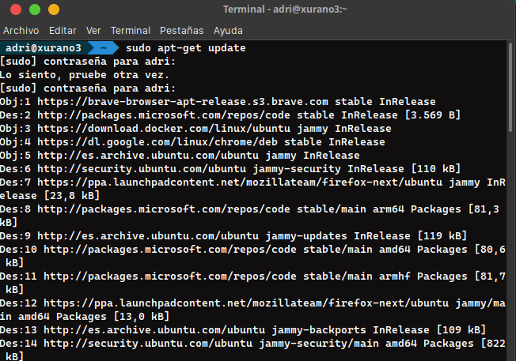
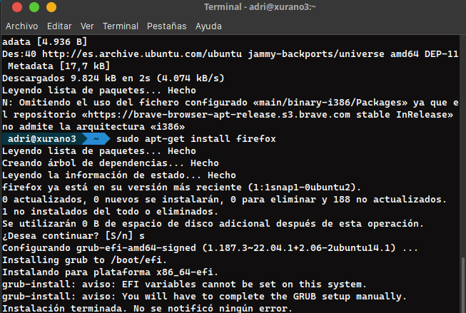
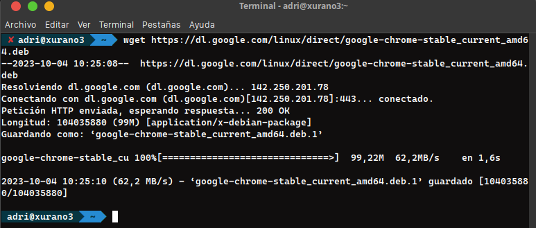
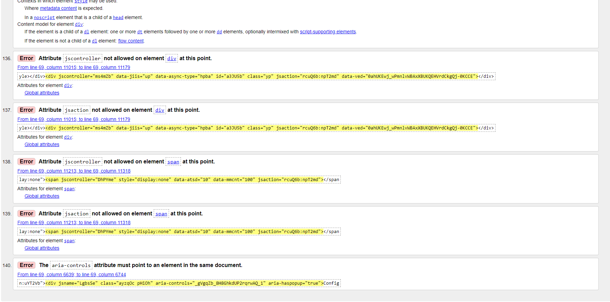

<center>

# INSTALACIÓN Y CONFIGURACIÓN DE UN ENTORNO PARA JAVASCRIPT

</center>

**_Nombre:_** Adrián Herrera Brito

**_Curso:_** 2º de Ciclo Superior de Desarrollo de Aplicaciones Web. Desarrollo en entorno Cliente

### ÍNDICE

- [Introducción](#id1)
- [Desarrollo](#id4)
- [Validador](#id5)

#### **_Introducción_**. <a name="id1"></a>

En esta actividad vamos a realiza la instalación y configuración de un entrono para trabajar con Javascript. Debemos tomar varias decisiones sobre qué navegadores instalar para comprobar el funcionamiento del código Javascript y también seleccionaremos un editor de texto o IDE.

Los navegadores que vamos a seleccionar van a ser:

- Google chrome: Esta es nuestra primera elección de navegador porque es actualmente el navegador nº1 en cuanto a uso en el mundo. En 2021, ya abarcaba alrededor de un 63,60% del mercado de los navegadores de internet y en este año 2023, se predice que esa cifra ascenderá a 77.03%. Este es un motivo de peso, pues teniendo en cuenta este dato, nuestro código va a ser ejecutado en chrome en (aproximadamente) un 60% o más de las ocasiones. Además, chrome ofrece unas herramientas de desarrollador bastante cómodas y modernas para poder trabajar con ellas mientras desarrollamos nuestro código. Por otro lado, Chrome permite una gran variedad de extensiones para descargar que nos pueden servir de ayuda para probar funcionalidades o incluso alguna herramienta que nos ayude a desarrollar.

- Firefox: Nuestra segunda elección es Firefox, puesto es el tercer navegador más utilizado justo por detras de Safari. Como Safari trabaja en Mac y se trata de una empresa privada y un software propietario no podemos descargarlo, pero utilizaremos Firefox. En este 2023, se prevé que Firefox ocupará un 7.69% del mercado, una cifra que aparentemente es baja pero es debido a que chrome sigue comiendose el mercado de los navegadores. Además de los motivos ya mencionados en Chrome, Firefox es un navegador muy personalizable que nos permitirá ver como se adapta nuestro código a esas personalizaciones y, también, tiene una muy buena seguridad, aspecto que quizá nos ayude a no tener tanto en cuenta este apartado a la hora de desarrollar.

En cuanto al editor de texto o IDE:

- Visual Studio Code: VScode va a ser nuestra elección para el entorno. Uno de los motivos principales y de peso es que, desde el año pasado hemos trabajado con esta herramienta y estamos muy habituados a su uso, lo cual es una ventaja ya que solo nos centraremos en programar y aprender nuevas tecnologías sin incorporar una piedra más en el camino que sería el adaptarnos a un nuevo editor de texto. Además, es un IDE muy desarrollado que cuenta con numerosas extensiones para facilitarnos el trabajo a la hora de desarrollar. Por último, tiene una interfaz muy cómoda en la que podemos consultar mucha información y tener más control sobre lo que está pasando y estamos haciendo.

#### **_Desarrollo_**. <a name="id4"></a>

En primer lugar, vamos con la instalación de Firefox.

1. En primer lugar, vamos a actualizar nuestro sistema operativo (Linux en mi caso) para poner todos los repositorios y paquetes al día. Lanzamos en terminal:

```
sudo apt-get update
```

<div align="center">

</div>

2. Para instalar Firefox, utilizaremos los paquetes que nos ofrece la distribución de Linux (En mi caso Xubuntu) y utilizaremos el apt-get para bajarnos el navegador. El comando a lanzar es:

```
sudo apt-get install firefox
```

<div align="center">

</div>

Con estos pasos tan sencillos ya tenemos uno de los dos navegadores que habiamos seleccionado.

Ahora, vamos con la instalación de Google Chrome que también realizaremos en terminal:

1. Google Chrome no viene por defecto en los paquetes y repositorios de linux, por lo que vamos a tener que usar wget para añadir el archivo .deb de chrome y luego lo instalaremos con dpkg. El primer comando que lanzaremos para añadir chrome será:

```
wget https://dl.google.com/linux/direct/google-chrome-stable_current_amd64.deb
```

<div align="center">

</div>

2. Con el paquete agregado vamos a utilizar dpkg para instalarlo y listo:

```
sudo dpkg -i google-chrome-stable_current_amd64.deb
```

<div align="center">

</div>

Con estos sencillos pasos, ya tenemos ambos navegadores instalados. Linux ofrece unas formas muy ágiles para las instalaciones de este tipo a través de terminal. Ahora vamos a pasar a la instalción del editor de código que en nuestro caso será VScode.

La instalación será muy sencilla, solo tendremos que seguir los pasos que nos indica la página de VScode. Simplemente descargaremos el archivo según nuestra distribución en la propia página y ese archivo que se nos descarga será el instalador. Lo ejecutamos haciendo click en él y simplemente seguiremos los pasos que el instalador nos dice. Nos preguntará cosas típicas como dónde queremos guardar la aplicación (en qué directorio) y alguna pequeña configuración. Siguiendo estos sencillos pasos, ya tenemos todo lo que se solicita instalado y listo para usar.

#### **_Validador_**. <a name="id5"></a>

Ahora, vamos a realizar la validación de la página de google. Para ello, pasaremos su código fuente al validador de W3C, que nos dirá los errores y problemas encontrados respecto al estándar que se marca. Para obtener el código fuente, es tan sencillo como pulsar botón derecho en la página de google y darle al botón de ver código fuente, y de ahí copiaremos ese código para introducirlo en el validador. El código obtenido es el siguiente:

```html
<!DOCTYPE html>
<html dir="ltr" lang="es">
  <head>
    <meta charset="utf-8" />
    <title>Nueva pestaña</title>
    <style>
      body {
        background: #445760;
        margin: 0;
      }

      #backgroundImage {
        border: none;
        height: 100%;
        pointer-events: none;
        position: fixed;
        top: 0;
        visibility: hidden;
        width: 100%;
      }

      [show-background-image] #backgroundImage {
        visibility: visible;
      }
    </style>
  </head>
  <body>
    <iframe id="backgroundImage" src=""></iframe>
    <ntp-app></ntp-app>
    <script type="module" src="new_tab_page.js"></script>
    <link rel="stylesheet" href="chrome://resources/css/text_defaults_md.css" />
    <link rel="stylesheet" href="chrome://theme/colors.css?sets=ui,chrome" />
    <link rel="stylesheet" href="shared_vars.css" />
  </body>
</html>
```

Sorprendentemente, el validador nos da un error en una parte del código. Resulta extraño al tratarse de una página de una empresa tan importante como google que abarca gran parte del mercado tecnológico. El error salta en la pimera de las etiquetas en el body, en la etiqueta iframe. El validador nos dice que uno de los atributos de esa etiqueta, el src, está vacío. Ese atributo src, en el contexto de la etiqueta iframe sirve para indicar la fuente del contenido que se tendría que renderizar dentro de la etiqueta, y en este atributo se suele indicar un enlace a otra página o una ruta válida a algún contenido de internet. Para solucionar el error, bastaría con indicar alguna ruta dentro de ese atributo.

<div align="center">

</div>

Para solucionar el error, bastaría con pasar una url a ese atributo y el validador nos daría que todo está correcto
